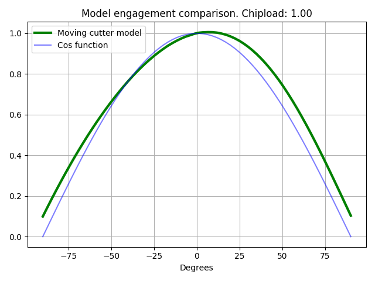
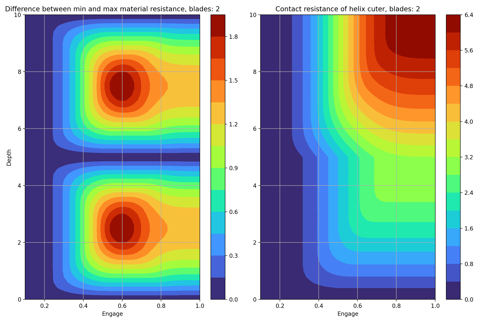

# CNC Milling tool engagment
During milling cutter spins and moves forward.
This project assumes to use Helix cutter with <2, 4> blades.

# Real engagment
Tool angagement is not stationary, its constantly moving forward. This graph shows where blade is touching wood piece 

Model of wood thickness width between 2cuts.
Wood thicknes is distance between P1 and P2.
-    P2 is point on cut for given cutter roation angle `w`
-    P1 is point on previous cut.
P1 is determined by intersection of line beween P2 and P0
-   P0 is center of spindle (moving point)

Real model is shown on picture below

This model is dependent on radius and chip size. Modeling this with trygonometry functions is not trival.

`Cos` function is based only on angle. Cos function as its faster to compute.
Using cutter aproximation will not lead to different results for this experiment (I have tested this). Difference in plots is negligible.

This simlpifcation removes also problem for non zero width at cuting angle -90 and 90. 
This effect occurs when chip size is big, we can spot not smooth surface that has very small paterns on sides.

# Simplified calculations

Plot of single blade touching material at start and end. Graph shows also integrated version (sum like) of contact distance. Script `ToolEngage.py` can be run for other values too.

# Force differences
This is not really a force, just how much resistance (wood) is opposing the cutter.

Left graph is difference between minimal force and maximum force in whole cycle.

Right graph shows force magnitude.

## Side note
`Y axis` can be treated as height fraction of full cycle depth.

Max depth distance is measured for 1 blade. It means how high is same blade after rotating it by 360°. Height change per revolution.

## Results of steady work
Combined plot, shows how magnitude scales with force differences.
Blue colors means work conditions are more stable! This should increase life of spindle.

# Summary
### Best engage for end cutters is:
- 2/4 blades: 50%
- 3 blades: 33% or 66%

Keep in mind bigger engage increased load on spindle.